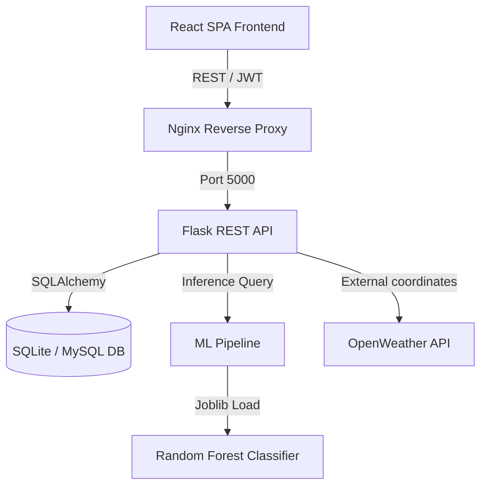

# AgroMind AI System Architecture & Future-Ready Design

This document details the software architecture, data flows, and design decisions behind AgroMind AI, emphasizing its readiness for enterprise scale and IoT integration.

---

## 1. System Architecture Diagram



---

## 2. Technical Stack Highlights
* **Decoupled Frontend-Backend REST Architecture**: Allows separate scaling, containerization, and updates for the frontend SPA and the Python backend.
* **Dual Database Adaptability**: SQLAlchemy supports instant local SQLite file-based runs (for rapid developer zero-config setups) and seamlessly connects to a production MySQL container using a simple connection string override.
* **Explainable AI Integration (XAI)**: Random Forest model feature importances are extracted on the fly and mapped as JSON fields. The frontend consumes this to render clean contribution graphs (Nitrogen weight, temperature weight) explaining *why* a crop was selected.

---

## 3. Future-Ready Architecture (IoT, Blockchain, Satellites)

The AgroMind system has been structured to easily support integration of high-level agricultural modules:

### 1. IoT Sensor Integration & Smart Devices
* **Design Ready**: The `SoilData` and `WeatherData` schemas allow capturing continuous time-series parameters.
* **IoT Linkage**: Edge soil sensors (e.g. NPK sensors, moisture probes) can post metrics directly to the Flask API endpoint:
  ```http
  POST /api/predictions/predict
  Authorization: Bearer <DEVICE_JWT_TOKEN>
  ```
  The endpoint will process inputs, log telemetry, trigger irrigation valves automatically, and store the crop records.

### 2. Yield Forecasting & Satellite Analytics
* **Satellite Feeds**: Future iterations can parse NDWI (Normalized Difference Water Index) or NDVI (Normalized Difference Vegetation Index) from Sentinel-2 or Landsat imagery.
* **Forecasting**: Deep learning LSTM (Long Short-Term Memory) networks can combine historical weather data and crop type to project seasonal yield rates.

### 3. Drone Imagery & Leaf Analytics
* **Drone Scanning**: Farmers can execute automated drone flight paths over fields, upload orthomosaics, crop individual leaves, and batch-upload them to `/api/disease/detect` to map disease spread across acres.

### 4. Blockchain Crop Traceability
* **Traceability**: Harvested crops can be minted with decentralized identifiers (DIDs). Every ML soil certificate, fertilizer report, and disease scan logged on AgroMind can be compiled into a cryptographic metadata hash and written to an Ethereum or Hyperledger block, ensuring crop history transparency.

### 5. Edge AI Deployment
* **Edge Inference**: The trained `best_model.joblib` can be compiled into an ONNX or TensorFlow Lite model and deployed locally onto Raspberry Pi or ESP32 microcontrollers in remote fields, allowing offline inference and local irrigation decisions.
